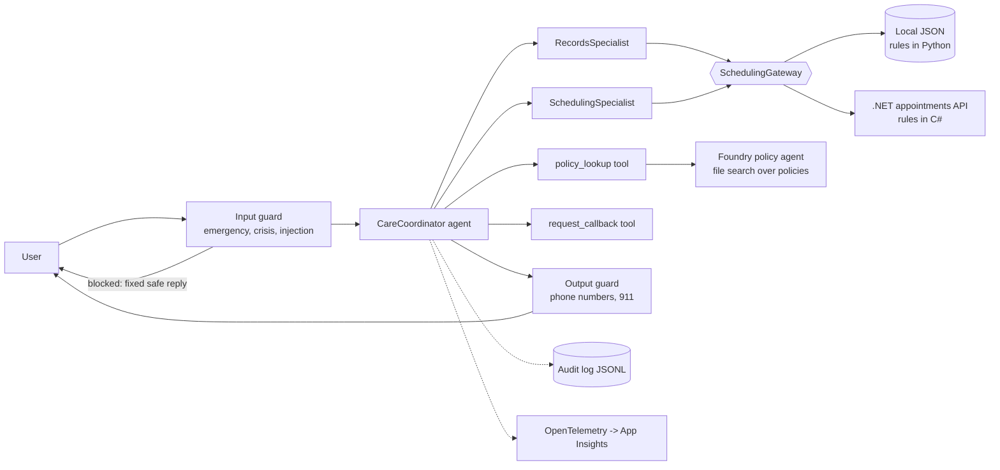

# CareCompanion

A safety-first patient-services assistant for a fictional UK hospital (**Elmfield Community
Hospital**), built on Microsoft Foundry and the Microsoft Agent Framework. It answers policy
questions from documents (RAG), checks and books appointments through tools, turns discharge
notes into plain-English summaries, and keeps deterministic guardrails, an audit trail, tracing
and an evaluation suite around the model.




## Quick start (macOS)

Prerequisites: Python 3.11+, Azure CLI, an Azure subscription with a Foundry project and a
`gpt-5-mini` deployment. .NET 8 SDK only if you want the appointments API.

```bash
az login
make setup                 # venv + dependencies, creates .env from .env.example
# edit .env: FOUNDRY_PROJECT_ENDPOINT, FOUNDRY_RESOURCE_ENDPOINT, FOUNDRY_MODEL_DEPLOYMENT_NAME
make test                  # 114 offline tests, no cloud needed
make eval-offline          # safety layer evaluation, no cloud needed
make check                 # first real call to your Foundry project
make index                 # build the policy knowledge base (vector store + agent)
make chat                  # talk to the assistant
```

Windows: use `python -m venv .venv`, `.venv\Scripts\activate`, then `pip install -e ".[dev,telemetry]"`
and call `carecompanion ...` directly instead of `make`.

## Commands

| Command | What it does |
|---|---|---|
| `carecompanion check` | config, sign-in and model check | Lab 1 |
| `carecompanion index` | vector store + versioned policy agent | Labs 2 and 4 |
| `carecompanion chat` | guarded multi-agent assistant | Labs 3 and 6 |
| `carecompanion discharge` | PDF -> Markdown -> validated JSON -> summary -> verification | Labs 5 and 6 |
| `carecompanion docs-helper "..."` | agent using the Microsoft Learn MCP server | Lab 7 |
| `carecompanion mcp-serve` | our own MCP server exposing the scheduling tools | new |
| `carecompanion eval --suite ...` | run evaluation cases, save a JSON report | new |
| `carecompanion eval-compare A B` | before/after table with fixes and regressions | new |
| `carecompanion export-api-config` | write `hospital.json` for the .NET service | new |
| `carecompanion reset-data` / `cleanup` | clear local state / delete cloud objects | Lab 7 cleanup |

## Structure

```
config/hospital.toml       all hospital facts: contacts, opening hours, departments, rules
prompts/*.md               agent instructions as versioned files ($variables from the config)
data/                      patients, appointments, policies, discharge note, safety fixture
evaluation/cases.jsonl     36 evaluation cases as data
src/carecompanion/
  domain/                  pure models and errors (no I/O)
  scheduling/              ports, rules service, JSON repositories, HTTP gateway
  safety/                  deterministic input and output guards, fixed safe messages
  audit/                   append-only JSONL audit log (content redacted by default)
  tools/                   thin, validated function tools + human hand-off queue
  agents/                  Foundry/Agent Framework construction (only place that touches Azure)
  documents/               Content Understanding, JSON validation, summary verification
  mcp_server/              our MCP server
  evaluation/              cases, graders, runner, report comparison
  container.py             composition root: the only place concrete classes are chosen
  app.py                   guard -> agent -> guard, with audit, tracing and error handling
services/appointments-api/ .NET 8 minimal API, system of record for appointments
tests/                     114 offline tests (no network, no credentials)
docs/                      architecture, decisions (ADRs), API contract, run sheet
```

## Design principles applied

- **Separation of concerns and ports/adapters.** Business rules sit behind a `SchedulingGateway`
  port with two adapters (local Python, remote .NET). Azure code is confined to `agents/` and
  `documents/`, so everything else is testable offline.
- **Rules in code, not in prompts.** Booking rules (future date, weekdays, duplicates, slots) and
  safety checks are deterministic. Prompts describe behaviour; code enforces guarantees.
- **Single source of truth.** Hospital facts live in `config/hospital.toml` and are injected into
  prompts and the .NET service; a test fails if they drift.
- **Data minimisation and privacy.** The model only ever sees a patient's id and name. Audit logs
  record lengths, not message text, unless you opt in.
- **Fail safe and degrade gracefully.** Tools never raise into the model; outages become clear
  errors and a callback offer. Emergency wording is answered by code before the model runs.
- **Treat model output and retrieved text as untrusted.** JSON is validated, phone numbers are
  whitelisted, retrieved policy text is labelled as data, and an injection test set exists.
- **Observable and measurable.** Audit trail, OpenTelemetry spans (Application Insights), and an
  evaluation harness with a `--no-guardrails` baseline for honest before/after numbers.
- **Testable by construction.** Clock, repositories and coordinator are injected.

## Evaluation workflow (the "before/after" story)

```bash
make eval-offline      # deterministic safety cases
make eval-baseline     # live cases, guardrails OFF
make eval-hardened     # live cases, guardrails ON
make compare           # table of fixes and regressions
make eval-injection    # indirect prompt injection via a poisoned policy document
```

## What has and has not been verified

Verified here: all 114 offline tests pass; the deterministic evaluation passes 17/17; imports and
constructors work against the real `agent-framework` 1.19, `azure-ai-projects` 2.6 and
`azure-ai-contentunderstanding` packages; agents and tools build with fake endpoints.

## Safety note

This is a demonstration built on synthetic data. It is not a medical device and has not been
clinically validated. Do not point it at real patient data or use it with real patients.
